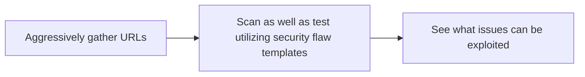

<h1 align="center">yublueflower</h1>

<p align="center">
  A tailored workflow suite for offensive security.
</p>

<p align="center">
  
</p>

## Overview

```bash

       .   .-~\
      /'.'   `-:
      | /       `._
      || .-.      {
      |\ `-'       `.
   .  \|            /   We exploit flaws, not people.
 ~-.`.\\|        .-~_
    `.\-\     .-~   \
      `-'\~~.~      /
    .-~/|`-/~-.~--~
   /  |  \   ~-_\

Author        : 1337rokudenashi
Version       : yublueflower v0.0.5 (latest)
Tagline       : yublueflower — A tailored workflow suite for offensive security.
Time          : 13:37:00 01-05-2025
Architecture  : Kali GNU/Linux Rolling (x86_64)
Uptime        : 13 hours, 37 minutes

Usage:
yublueflower --url http://testphp.vulnweb.com

Options:
--help                    Show help message.
--url string[]            Scan as well as test utilizing security flaw templates.
--non-intrusive-gather    Use --non-intrusive-gather sources to gather URLs (Wayback, AlienVault, Common Crawl).
--silent                  Skip noisy URL logs.
--highly-aggressive-test  Use --highly-aggressive-test to uncover less obvious flaws.
--pipe-urls               Works great with piped input.
```

It has been tested to work smoothly on WSL (Windows Subsystem for Linux) with Kali Linux.

## Workflow



## System Requirements

- **Operating System**: WSL (Windows Subsystem for Linux) with Kali Linux
- **Dependencies**: go.dev (see [installation instructions](https://go.dev/doc/install))
- **Dependencies**: nodejs (see [installation instructions](https://nodejs.org/en/download))

## Installation

To install yublueflower, clone the repository and set up the tool as follows:

```bash
git clone https://github.com/1337rokudenashi/yublueflower.git
cd yublueflower
bash yublueflower
```

## Usage

To run the tool, use the following command:

```bash
yublueflower --url http://testphp.vulnweb.com/
```

```bash
       .   .-~\
      /'.'   `-:
      | /       `._
      || .-.      {
      |\ `-'       `.
   .  \|            /   We exploit flaws, not people.
 ~-.`.\\|        .-~_
    `.\-\     .-~   \
      `-'\~~.~      /
    .-~/|`-/~-.~--~
   /  |  \   ~-_\

Author        : 1337rokudenashi
Version       : yublueflower v0.0.5 (latest)
Tagline       : yublueflower — A tailored workflow suite for offensive security.
Time          : 13:37:00 01-05-2025
Architecture  : Kali GNU/Linux Rolling (x86_64)
Uptime        : 13 hours, 37 minutes

Testing started at 13:37:00 01-05-2025
🟢 Aggressively gather URLs...
http://testphp.vulnweb.com/showimage.php?file=yublueflower
http://testphp.vulnweb.com/hpp/?pp=yublueflower
http://testphp.vulnweb.com/artists.php?artist=yublueflower
http://testphp.vulnweb.com/hpp/params.php?p=yublueflower
http://testphp.vulnweb.com/listproducts.php?cat=yublueflower
http://testphp.vulnweb.com/product.php?pic=yublueflower
🟢 Scan as well as test utilizing security flaw templates...
[waf-detect:nginxgeneric] [http] [info] http://testphp.vulnweb.com
[http-missing-security-headers:x-permitted-cross-domain-policies] [http] [info] http://testphp.vulnweb.com
[http-missing-security-headers:referrer-policy] [http] [info] http://testphp.vulnweb.com
[http-missing-security-headers:cross-origin-opener-policy] [http] [info] http://testphp.vulnweb.com
[http-missing-security-headers:cross-origin-resource-policy] [http] [info] http://testphp.vulnweb.com
[http-missing-security-headers:strict-transport-security] [http] [info] http://testphp.vulnweb.com
[http-missing-security-headers:permissions-policy] [http] [info] http://testphp.vulnweb.com
[http-missing-security-headers:x-frame-options] [http] [info] http://testphp.vulnweb.com
[http-missing-security-headers:x-content-type-options] [http] [info] http://testphp.vulnweb.com
[http-missing-security-headers:clear-site-data] [http] [info] http://testphp.vulnweb.com
[http-missing-security-headers:cross-origin-embedder-policy] [http] [info] http://testphp.vulnweb.com
[http-missing-security-headers:content-security-policy] [http] [info] http://testphp.vulnweb.com
[clientaccesspolicy] [http] [info] http://testphp.vulnweb.com/clientaccesspolicy.xml
[nginx-version] [http] [info] http://testphp.vulnweb.com ["nginx/1.19.0"]
[php-detect] [http] [info] http://testphp.vulnweb.com ["5.6.40"]
[tech-detect:dreamweaver] [http] [info] http://testphp.vulnweb.com
[tech-detect:nginx] [http] [info] http://testphp.vulnweb.com
[tech-detect:php] [http] [info] http://testphp.vulnweb.com
[idea-folder-exposure] [http] [info] http://testphp.vulnweb.com/.idea/workspace.xml
[caa-fingerprint] [dns] [info] testphp.vulnweb.com
[txt-fingerprint] [dns] [info] testphp.vulnweb.com [""google-site-verification:toEctYsulNIxgraKk7H3z58PCyz2IOCc36pIupEPmYQ""]
[sqli-error-based:mysql] [http] [critical] http://testphp.vulnweb.com/artists.php?artist=yublueflower' ["SQL syntax; check the manual that corresponds to your MySQL","check the manual that corresponds to your MySQL server version"] [query:artist] [GET]
[reflected-xss] [http] [medium] http://testphp.vulnweb.com/artists.php?artist=yublueflower'"><62931> [query:artist] [GET]
[reflected-xss] [http] [medium] http://testphp.vulnweb.com/hpp/?pp=yublueflower'"><70001> [query:pp] [GET]
[reflected-xss] [http] [medium] http://testphp.vulnweb.com/hpp/params.php?p=yublueflower'"><57631> [query:p] [GET]
[sqli-error-based:mysql] [http] [critical] http://testphp.vulnweb.com/listproducts.php?cat=yublueflower' ["SQL syntax; check the manual that corresponds to your MySQL","check the manual that corresponds to your MySQL server version"] [query:cat] [GET]
[reflected-xss] [http] [medium] http://testphp.vulnweb.com/listproducts.php?cat=yublueflower'"><55382> [query:cat] [GET]
[sqli-error-based:mysql] [http] [critical] http://testphp.vulnweb.com/product.php?pic=yublueflower' ["SQL syntax; check the manual that corresponds to your MySQL","check the manual that corresponds to your MySQL server version"] [query:pic] [GET]
[reflected-xss] [http] [medium] http://testphp.vulnweb.com/product.php?pic=yublueflower'"><50858> [query:pic] [GET]
[linux-lfi-fuzz] [http] [high] http://testphp.vulnweb.com/showimage.php?file=../../etc/passwd [GET]
🟢 See what issues can be exploited...
We exploit flaws, not people. /home/yublueflower/glow_yublueflower — security issues await.
Testing finished at 13:44:00 01-05-2025
Use command glow yublueflower_20250501_133700 to see what issues can be exploited.
```

## Contributing

We welcome contributions! Feel free to fork the repository, improve the tool, and submit a pull request.

## License

This project is licensed under the MIT License. See the [LICENSE](LICENSE) file for details.

## Author

Developed and maintained by 1337rokudenashi...
